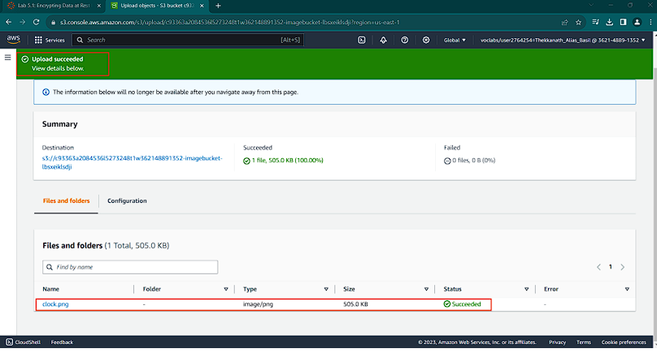

# 🔐 AWS KMS – Encrypting Data at Rest

This project demonstrates **encryption at rest in AWS** using **AWS Key Management Service (KMS)**.  
The lab focused on securing Amazon S3 objects and EC2 volumes with **customer-managed keys (CMKs)**.

---

## 📌 Objectives
- Create and manage a **customer-managed AWS KMS key**.
- Encrypt objects stored in **Amazon S3** using SSE-KMS.
- Test **public vs. signed access** to encrypted objects.
- Monitor **AWS KMS events** using **CloudTrail**.
- Encrypt the **root volume of an EC2 instance**.
- Analyze the effect of **disabling a KMS key** on encrypted resources.

---

## 🏗️ Architecture

  
  
  

---

## 🚀 Tasks & Highlights

### 1️⃣ Creating a KMS Key
- Created a **symmetric CMK** named `MyKMSKey`.
- Assigned IAM role permissions for key administration and usage.

📸 Screenshot:  

  
  

---

### 2️⃣ Encrypting & Storing Objects in S3
- Verified **default bucket encryption**.
- Uploaded `clock.png` explicitly encrypted with `MyKMSKey`.

📸 Screenshot:  

  
  

---

### 3️⃣ Testing Public Access
- Public access resulted in **Access Denied** and **Invalid Argument** errors.
- Demonstrated that encryption prevents unauthorized access even with public permissions.

📸 Screenshot:  

  
  

---

### 4️⃣ Signed Access (Authorized Decryption)
- Accessed `clock.png` as an authorized user.
- Decryption worked automatically via the S3 console using signed URL.

📸 Screenshot:  

  
  

---

### 5️⃣ Monitoring KMS Events in CloudTrail
- Tracked **GenerateDataKey** (on file upload) and **Decrypt** (on file access).
- CloudTrail logs confirmed the linkage between S3 and KMS.

📸 Screenshot:  

  
  

  

  

  
  

---

### 6️⃣ Encrypting EC2 Root Volume
- Stopped the instance, created snapshot of unencrypted root volume.
- Created an **encrypted volume** with `MyKMSKey`.
- Swapped old root volume with encrypted one.

📸 Screenshot:  

  
  

---

### 7️⃣ Disabling the KMS Key
- Disabled `MyKMSKey` → EC2 failed to boot + S3 object access failed.
- Errors confirmed reliance on KMS for decryption.

📸 Screenshot:  

  
  

  
  

---

## 📖 Key Learnings
- **Encryption at rest** in AWS is tightly integrated with KMS.
- **Public access ≠ decrypted access** — encryption enforces an additional security layer.
- **CloudTrail** provides deep visibility into KMS usage.
- Proper **key lifecycle management** is critical: disabling keys can break workloads.
- Always label and manage volumes clearly when swapping encrypted/unencrypted resources.

---
